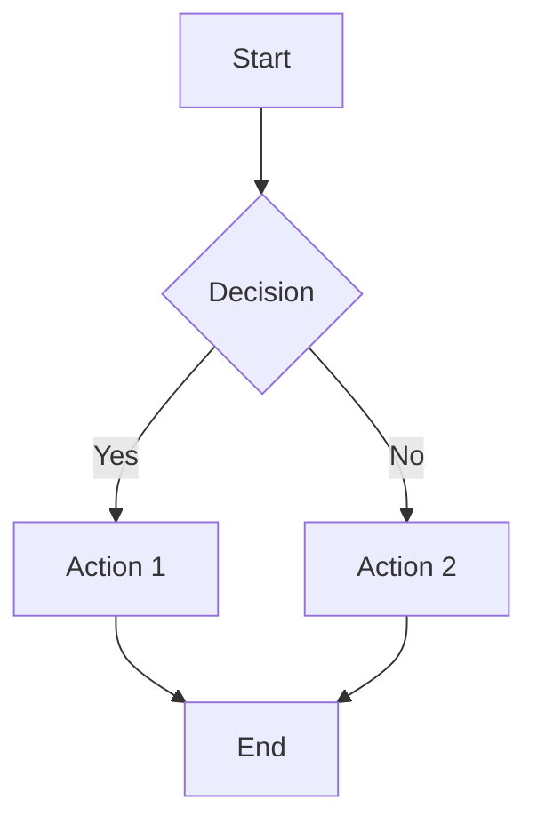

# merdoc

A command-line tool for converting Markdown files to HTML and PDF with support for Mermaid diagrams.

## Features

- Convert Markdown to HTML and PDF
- Full support for Mermaid diagrams (rendered as SVG)
- Beautiful Solarized Dark theme for HTML output
- Watch mode with automatic regeneration and browser refresh
- Clean, responsive HTML output with embedded CSS
- PDF generation via LaTeX with Unicode support (xelatex/lualatex preferred)
- Standalone operation - no external dependencies for HTML generation
- Intelligent zsh tab completion with file descriptions

## Installation

Run the install script:

```bash
cd merdoc
./install.sh
```

This will:
- Install pandoc via Homebrew
- Install fswatch for watch functionality
- Install the Mermaid CLI via npm
- Download the pandoc diagram filter
- Optionally install MacTeX for PDF generation

## Usage

```bash
# Generate both HTML and PDF
merdoc document.md

# Generate only HTML
merdoc --html-only document.md

# Generate only PDF (requires LaTeX)
merdoc --pdf-only document.md

# Verbose output
merdoc --verbose document.md

# Watch mode - auto-regenerate on file changes
merdoc --watch document.md
```

## Example

Given a markdown file `example.md`:

```markdown
# My Document

## Flow Chart



## Content

Some regular markdown content.
```

Running `merdoc example.md` will generate:
- `example.html` - HTML file with embedded Mermaid diagram as SVG
- `example.pdf` - PDF file (if LaTeX is installed)

## Requirements

- **pandoc** - Document converter
- **fswatch** - For watch mode functionality
- **Node.js/npm** - For Mermaid CLI
- **LaTeX** (optional) - For PDF generation (install MacTeX on macOS)

## Supported Diagram Types

The underlying pandoc diagram filter supports:
- Mermaid
- GraphViz/Dot
- PlantUML
- TikZ
- Asymptote
- D2

## How Live Reload Works

When using `--watch` mode, merdoc implements a sophisticated live reload system:

1. **WebSocket Server**: A Python WebSocket server runs on `localhost:35729`
2. **Embedded Client**: The generated HTML includes a WebSocket client script
3. **File Watching**: `fswatch` monitors the markdown file for changes
4. **Auto-Regeneration**: When changes are detected, HTML is regenerated
5. **Browser Refresh**: A reload signal is sent via WebSocket to refresh the browser
6. **Reconnection**: The client automatically reconnects if the connection is lost

This provides a seamless development experience with instant preview updates.

## Tab Completion

The tool includes intelligent zsh tab completion that:

- **Smart option completion**: Completes all command-line options with descriptions
- **Markdown file detection**: Only shows `.md` files when completing filenames
- **File descriptions**: Shows the document title (first line) as completion description
- **Mutual exclusion**: Prevents conflicting options like `--html-only` and `--pdf-only`
- **Context awareness**: Provides relevant completions based on current options

The completion is automatically available after installation and sourcing the environment.

## PDF Generation

The tool automatically selects the best available LaTeX engine for PDF generation:

1. **xelatex** (preferred) - Excellent Unicode support, handles emoji and special characters
2. **lualatex** (fallback) - Good Unicode support, modern LaTeX engine
3. **pdflatex** (last resort) - Basic LaTeX engine, limited Unicode support

The tool uses appropriate fonts and settings for each engine to ensure the best output quality. Unicode characters like emoji may show warnings but won't break the PDF generation process.

## Notes

- HTML output uses a beautiful Solarized Dark theme with embedded CSS
- Mermaid diagrams are rendered as inline SVG for best quality
- Watch mode uses a Python virtual environment for WebSocket functionality
- PDF generation requires a LaTeX installation (MacTeX recommended on macOS)
- Use `--html-only` if you don't need PDF output
